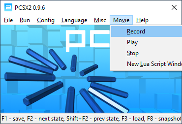
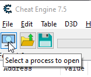
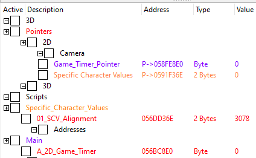
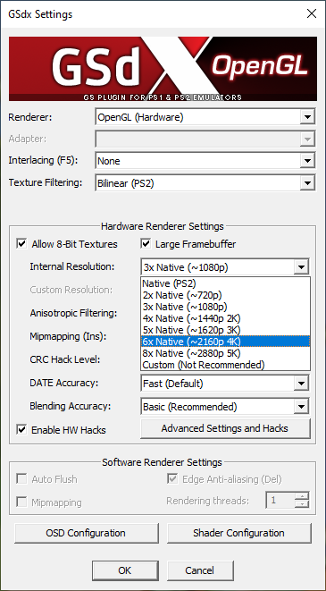
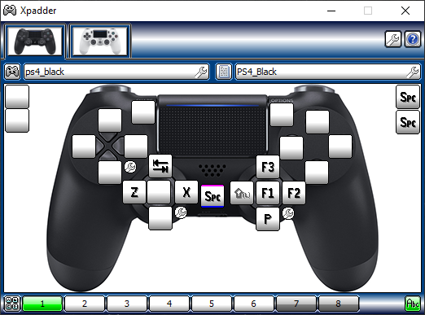
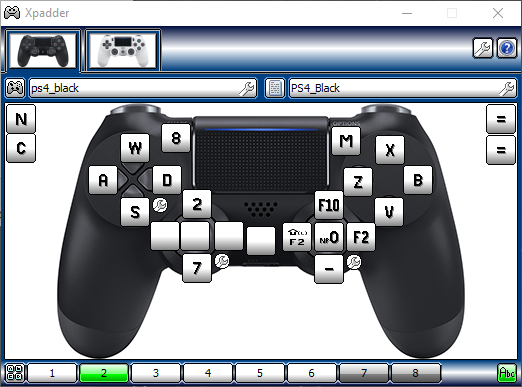
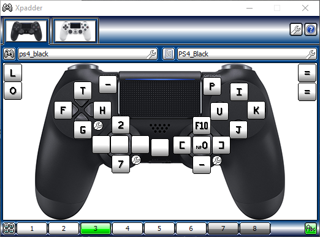

# Emulator and Cheat Engine
## PCSX2
### PCSX2-RR Hotkeys
- **F1**: Save State
- **F2**: Move to next state
- **Shift+F2**: Move to previous state
- **F3**: Reload state
- **F4**: Display mode
- **R**: Read On / Read Off
- **Tab**: Speed (Related to F4)
- **P**: Pause / Unpause
- **Space**: Advance one frame at a time
- **F12**: Record
- **Escape**: Go back to PCSX2 menu

### State Management
- **State0**: Begin replay clip here
- **State1-9**: Re-write
### Playing a Movie/Replay
- PCSX2 Main Window: `Movie` > `Play`.
- Click on `ReadOnly` > `Load`. 
- Once the emulator starts, check if state is zero using `F2` and `Shift+F2`.
### Record a Movie/Replay
- PCSX2 Main Window: `Movie` > `Record`.
- Once the emulator starts, check if state is zero using `F2` and `Shift+F2`.
  

### Cheat Engine Instructions
0. Set the process to PCSX2

    
    
1. Recalculate (Copy):

    
    
   - Go to `Pointers` in red.
   - Go to `Game_Timer_Pointer` in purple .
   - Double Click the `P->0x05xxxxxx` numbers.
   - Copy `Address`.

2. Recalculate (Paste):
   - Go to `Main` in purple in the table.
   - Go to `A_2D_Game_Timer` in red.
   - Right click and select `Recalculate new Addresses...`.
   - Click on the tab called `Change to address`.
   - Paste.
   
3. Repeat process for `Specific_Character_Values` with `01_SCV_Alignment`. 

### Notes
  - Video Settings:
  
    `
    
### XPadder
- Set both controllers to profile `1`.

  `

### Sizer PCSX2 Hotkeys
- Game:     Win+Num1
- Console:  Win+Num2

---
## Demul

### Cheat Engine Instructions

### Hitboxes

0. Set the process to DEMUL

    
1. Sync the Lua Script
- In Cheat Engine, press `CTRL+ALT+L`.
- Execute Script once the emulator is running MVC2.

---

### Hitbox Colors
- **Blue**: Hurtbox
- **Green**: Collision
- **Red (non-active)**: Throw-box
- **Red (active on attacks)**: Hitbox

### XPadder
- Set a Controller to be Profile `2`.
- Set a Controller to be Profile `3`.

---

### Notes
- If the game or Cheat Engine malfunctions, restart BOTH Cheat Engine and Demul. Reset the situation back to where you need to be able to execute the script on Demul (make sure Demul is selected as the process after restarting Cheat Engine).

- If you don’t see the Console/Window on the Demul Cheat Engine View, go to:
  - **Table > Console/Form... > Restore & Show**

### Demul Hotkeys
- Set Hotkeys manually from emulator
- Frame-stepping, etc., will not work unless the Cheat Table is running.

### Sizer Demul Hotkeys
- 4K:       Ctrl+Alt+\1
- 1080:     Ctrl+Shift+\
