# Entelechy

## Ideas 💡

* Bison Delay Kneepress from across a screen
  * Isn't OTG
  * Slow to come out, no FSD followups
  * Can hit after snap > dhc
* Combo Meter bug using 1f air stun. ex spiral level3 grab, dhc
* Anakaris & Doom instant land go under-dummy
* Sentinel corner mekuri vs Capcom or Jin, spawn drones underneath them
* No-Count OTG with Hayato Dash-HP
* Strider Double-Bomb using Counter-Bug
  * HK bomb, interrupt, counter, counter back into bird, interrupt, hk or LK bomb
  * Flip Side with 2nd Bomb?
* Cable FSI with 2HP, SJC vs Felicia Yarn into y_boost
* Block Meter that allows movement only as well as quick-land to block something, quick land with doom or anak?
* Ruby, Tron, Rogue-AA, Chain, Trip, Barrel, DHC, Auto-Assist again 1F on DC?

## OK ✅

* Triple FSD-B Setup: Magneto, Wolverine, Bison VS Roll + Amingo
* Combo after throw with Spiral
* Tag causes Dizzy/Spin-Out > Punish!
* Psylocke + Ruby-Y: HP SJGC
* Psylocke vs Marrow & War Machine (and Sonson?) no-damage

## NG ❌

* Jill Zombie with Fire OTG
* Samurai s.HP , c.LP s.HP infinite
* Blackheart-B THC Unblockable on Incoming and maybe with other characters like Thanos/Jin?
* Cable HK-Long-Hold Grenade > FSD with something > Grenade puts them back into standing? or knockdown into grenade that puts them into standing, FSD mid-screen?
* Venom FSD normalization vs Roll

## Idea Video 📽️

* Magneto HK-Forcefield hitstop vs Colossus assist vs Point-Character who will be frozen anywhere (?)
* Colossus QCF+LP, FSD, DHC-Wolverine-QCF+PP, DHC-Strider-QCF+PP, Grab, FSD, DHC, TAG, Special-Grab FSD again
* Servbot-B QCF+PP, Sentinel QCF+PP
* Magneto: QCF+PP, Spider-Man: QCF+PP / Chun-Li: QCF+KK, X: DHC
* Sentinel assist 1 bug w/ Venom Rush switch side stuff vs Jin

## Edit 🎦

* VS-Sentinel Mekuri Infinites
* VS-Capcom j.infinite: Strider Psylocke, Chun-Li, Guile, Charlie  -> FSD & Assist Followup: Guile, Charlie, Ken ( FSD > Assist > OTG )
* Juggernaut HP-Punch > Headcrush V2

## Research 🔬

* Ken, Dan, Akuma, Charlie, Guile FSD -> THC spacing fix.
* THC Unblockable Escape using Just-Defend and THC
* THC FSD: Wolverine/WolverineB
* DHC FSD: Magneto & Spider-Man or Chun-Li

```md
Stage Count:
  - Abyss     : 1
  - Boat1     : 3
  - Boat2     : 1
  - Bridge1   : 0
  - Bridge2   : 2
  - Carnival1 : 0
  - Carnival2 : 1
  - Cave1     : 2
  - Cave2     : 2
  - Clock1    : 0
  - Clock2    : 3
  - Desert1   : 1
  - Desert2   : 0
  - Factory   : 2
  - Raft1     : 2
  - Raft2     : 0
  - Training  : 0
```


#### Combo_Anakaris276_pcsx2

```md
ClipInfo
```

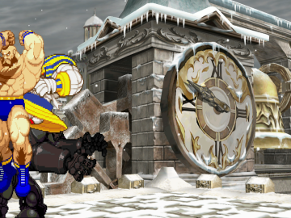

#### **Combo_Cable70_pcsx2**

```md
ClipInfo
```

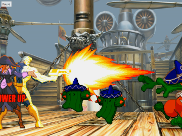

#### Combo_CaptainCommandoRogueCable8_pcsx2

```md
ClipInfo
```

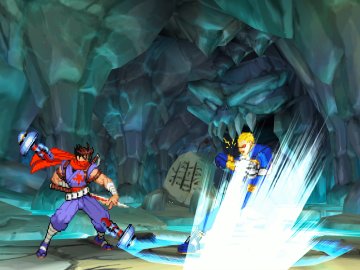

#### Combo_Dan31_pcsx2

```md
ClipInfo
```

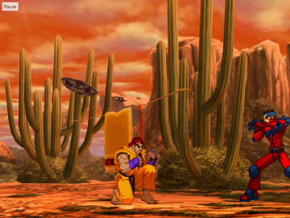

#### Combo_Guile19_pcsx2

```md
ClipInfo
```

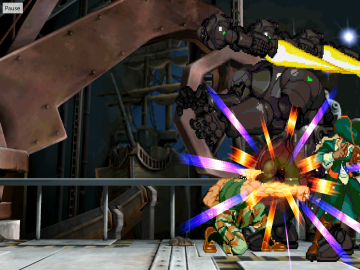

#### Combo_Hulk28_demul

```md
ClipInfo
```

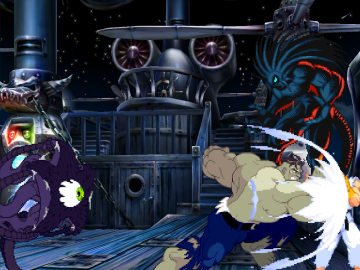

#### Combo_Iceman67_pcsx2

```md
ClipInfo
```

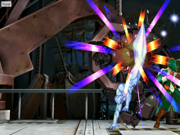

#### Combo_Juggernaut1_pcsx2

```md
ClipInfo
```

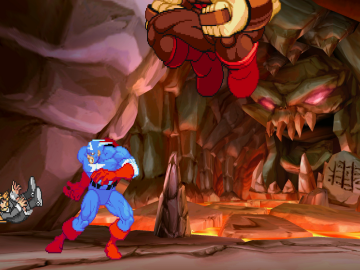

#### Combo_Magneto66_pcsx2

```md
ClipInfo
```

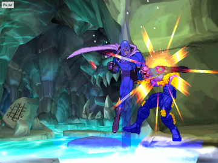

#### Combo_MagnetoBisonWolverine85_pcsx2

```md
ClipInfo
```

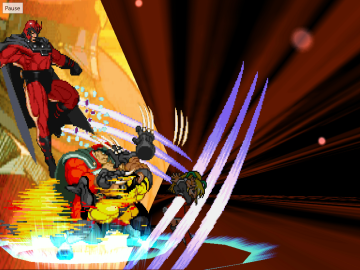

#### Combo_MagnetoGuile18_demul

```md
ClipInfo
```

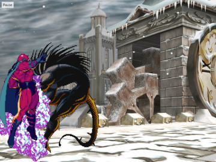

#### Combo_Morrigan115_pcsx2

```md
ClipInfo
```

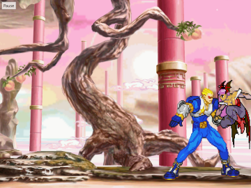

#### Combo_Sentinel52_pcsx2

```md
ClipInfo
```

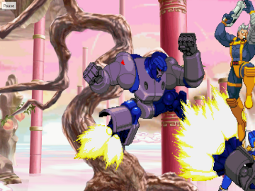

#### Combo_Spiral6_pcsx2

```md
ClipInfo
```

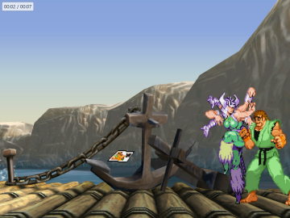

#### Combo_Storm114_pcsx2

```md
ClipInfo
```

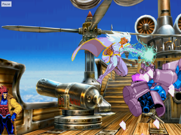

#### Combo_Venom17_pcsx2

```md
ClipInfo
```


#### NoDamage_Psylocke_WarMachine_pcsx2

```md
ClipInfo
```

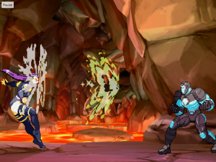

#### Situation_Hulk_Juggernaut_pcsx2

```md
ClipInfo
```

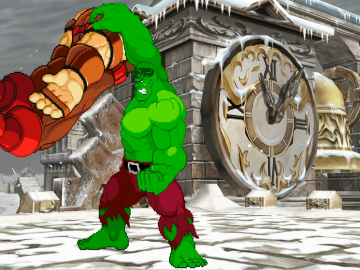

#### Situation_MagnetoSentinel_SentinelIronMan_pcsx2

```md
ClipInfo
```

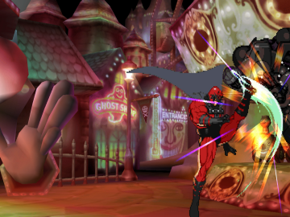
****
